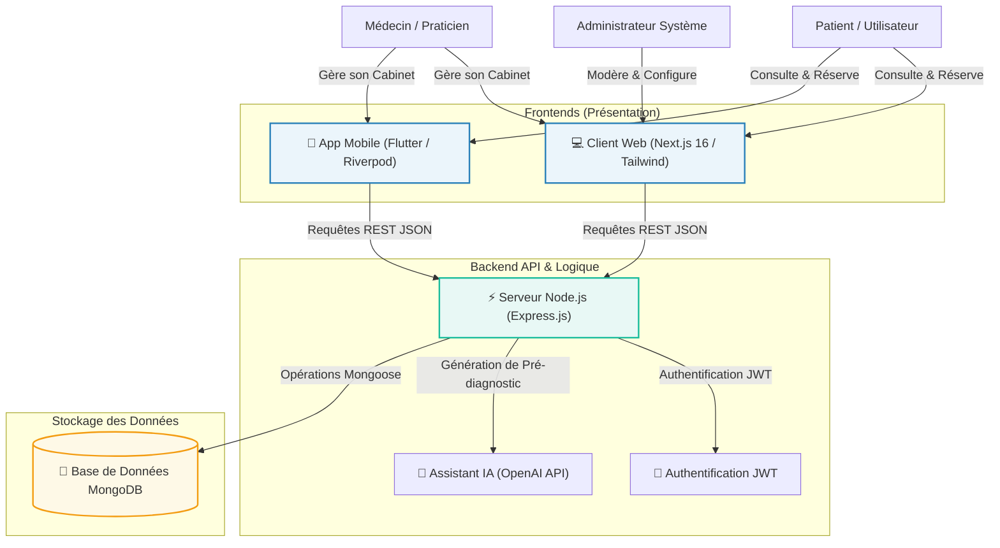

# 🏥 Saha-Link — Écosystème de Santé Connectée en Algérie

[](https://semver.org)
[](https://nextjs.org/)
[](https://nodejs.org/)
[](https://flutter.dev/)
[](#)

**Saha-Link (رابط الصحة)** est une plateforme médicale et de téléconsultation d'avant-garde conçue spécifiquement pour connecter les patients et les professionnels de la santé à travers les **58 Wilayas d'Algérie**. Cet écosystème multiplateforme regroupe une application web moderne sous Next.js, un serveur API robuste sous Express/MongoDB, et une application mobile multiplateforme développée sous Flutter.

---

## 📖 Sommaire

1. [🌟 Fonctionnalités Clés](#-fonctionnalités-clés)
2. [🏗️ Architecture Globale de l'Écosystème](#%EF%B8%8F-architecture-globale-de-lécosystème)
3. [💻 Piles Techniques (Tech Stack)](#-piles-techniques-tech-stack)
4. [📁 Structure du Projet](#-structure-du-projet)
5. [🔧 Guide d'Installation & Démarrage](#-guide-dinstallation--démarrage)
6. [📊 Modèle de Données (Base de Données)](#-modèle-de-données-base-de-données)
7. [🛡️ Sécurité & Bonnes Pratiques](#%EF%B8%8F-sécurité--bonnes-pratiques)
8. [🤝 Contribution & Licence](#-contribution--licence)

---

## 🌟 Fonctionnalités Clés

L'écosystème **Saha-Link** est structuré autour de rôles d'utilisateurs distincts avec des fonctionnalités de pointe entièrement localisées (bilingue Français/Arabe) :

### 👥 Espace Patient
- **Recherche Avancée de Médecins :** Annuaire complet filtrable par nom, spécialité (Cardiologie, Pédiatrie, Dermatologie, etc.), Wilaya (parmi les 58 Wilayas) et tarifs.
- **Réservation de Rendez-vous :** Calendrier interactif en temps réel avec sélection des créneaux horaires disponibles.
- **Dossier Médical Numérique (DMP) :** Consultation sécurisée de l'historique médical, diagnostics, ordonnances et commentaires des médecins.
- **Paiement & Facturation :** Interface de facturation sécurisée pour le règlement ou le dépôt des consultations en ligne ou en personne.
- **Messagerie Sécurisée :** Messagerie instantanée avec les médecins pour le suivi et les conseils.

### 👨‍⚕️ Espace Professionnel (Médecin)
- **Tableau de Bord Praticien :** Suivi complet des rendez-vous quotidiens, statistiques de consultations, revenus générés et avis des patients.
- **Gestion d'Emploi du Temps :** Configuration flexible des horaires de travail, des créneaux de téléconsultation et des consultations physiques.
- **Suivi Clinique des Patients :** Édition rapide des dossiers médicaux, saisie de diagnostics détaillés et génération d'ordonnances numériques.
- **Cabinet Virtuel :** Système de visioconférence intégré et sécurisé pour assurer des téléconsultations de haute qualité.

### 🤖 Assistant de Santé IA (AI Assistant)
- **Pré-diagnostic Intelligent :** Chatbot de santé propulsé par l'IA (OpenAI GPT) capable d'écouter les symptômes décrits par le patient, de fournir des conseils de santé préliminaires et d'orienter vers la spécialité médicale appropriée en Algérie.

### ✍️ Portail d'Information (Blog Médical)
- **Articles & Conseils :** Espace éducatif où les médecins agréés rédigent et publient des articles de prévention et des recommandations sanitaires validées scientifiquement.

### 🛡️ Espace Administration & Modération
- **Validation des Praticiens :** Approbation et vérification minutieuse des diplômes et adresses physiques des médecins avant leur mise en ligne.
- **Supervision Générale :** Suivi des métriques clés (utilisateurs inscrits, volume de rendez-vous), gestion des avis patients, réponses aux formulaires de contact et témoignages du site.

---

## 🏗️ Architecture Globale de l'Écosystème

L'écosystème Saha-Link repose sur un découpage orienté services, assurant une communication sécurisée et fluide entre les applications clientes et la base de données centrale :



---

## 💻 Piles Techniques (Tech Stack)

### 💻 Client Web (Projet `/client`)
- **Framework :** [Next.js 16](https://nextjs.org/) (App Router, React 19, TypeScript)
- **Design & Styles :** [Tailwind CSS v4](https://tailwindcss.com/) & [shadcn/ui](https://ui.shadcn.com/) pour des interfaces modernes et fluides.
- **Gestion des Formulaires :** `react-hook-form` avec validations de schémas par `zod`.
- **Composants Dynamiques :** `lucide-react` (icônes), `recharts` (graphiques statistiques), `sonner` (notifications tactiles et toast).
- **Internationalisation :** Fournisseur personnalisé multilingue (Français/Arabe) garantissant une traduction complète de la Landing Page et des tableaux de bord.

### ⚡ Serveur API (Projet `/server`)
- **Moteur :** [Node.js](https://nodejs.org/) & [Express.js](https://expressjs.com/)
- **Base de Données :** [MongoDB Atlas](https://www.mongodb.com/atlas/database) avec gestion de schémas par [Mongoose](https://mongoosejs.com/).
- **Sécurité :** Cryptage des mots de passe avec `bcryptjs` et authentification par jeton sécurisé [JWT](https://jwt.io/).
- **Intégration Extérieure :** OpenAI Node SDK pour l'alimentation de l'assistant virtuel.
- **Outils de Dev :** `nodemon` pour le rechargement à chaud lors du développement.

### 📱 Application Mobile (Projet `/saha link`)
- **Framework :** [Flutter SDK](https://flutter.dev/) (Dart compile natif iOS / Android / Web / Desktop)
- **Architecture :** **Clean Architecture** (Séparation stricte en couches : `core`, `features`, `shared`).
- **Gestion d'État :** [Riverpod (`flutter_riverpod`)](https://riverpod.dev/) pour un état réactif, robuste et testable.
- **Réseau :** [Dio](https://pub.dev/packages/dio) pour des requêtes HTTP puissantes et personnalisées (intercepteurs, gestion de timeouts).
- **Routage :** [GoRouter](https://pub.dev/packages/go_router) pour une navigation déclarative.
- **Stockage Local :** `flutter_secure_storage` (mots de passe/tokens chiffrés) et `shared_preferences` (préférences de l'application).

---

## 📁 Structure du Projet

Voici l'arborescence simplifiée de l'écosystème **Saha-Link** :

```text
medecine-app/
├── client/                      # APPLICATION WEB (Next.js)
│   ├── app/                     # Pages et Routage (App Router)
│   │   ├── about/               # Présentation de Saha-Link
│   │   ├── admin/               # Panel d'Administration
│   │   ├── ai-assistant/        # Chatbot IA intelligent
│   │   ├── blog/                # Blog médical & articles
│   │   ├── booking/             # Parcours de réservation de rendez-vous
│   │   ├── doctor/              # Dashboard Médecin
│   │   ├── doctors/             # Annuaire et filtres médecins
│   │   ├── patient/             # Dashboard Patient
│   │   ├── teleconsultation/    # Espace visioconférence médicale
│   │   ├── globals.css          # Style CSS global et variables
│   │   └── layout.tsx           # Layout structurel de base
│   ├── components/              # Composants réutilisables (shadcn/ui, UI personnalisées)
│   ├── providers/               # Contextes React (Thème, Traduction AR/FR)
│   ├── package.json             # Dépendances et Scripts Web
│   └── tsconfig.json            # Configuration TypeScript
│
├── server/                      # SERVEUR API (Node.js & Express)
│   ├── config/                  # Configuration (Connexion DB)
│   ├── controllers/             # Contrôleurs contenant la logique métier
│   ├── middleware/              # Filtres et Sécurité (Auth JWT, Rôles)
│   ├── models/                  # Modèles de données Mongoose (MongoDB)
│   ├── routes/                  # Points de terminaison API (Endpoints)
│   │   ├── adminRoutes.js
│   │   ├── appointmentRoutes.js
│   │   ├── authRoutes.js
│   │   └── doctorRoutes.js
│   ├── seed.js                  # Script d'amorçage avec de fausses données (Alger, Oran...)
│   ├── server.js                # Point d'entrée de l'application Express
│   └── package.json             # Dépendances et Scripts Serveur
│
└── saha link/                   # APPLICATION MOBILE (Flutter)
    ├── lib/                     # Fichiers de code source Flutter
    │   ├── core/                # Thèmes globaux, Réseau, Utilitaires, Erreurs
    │   ├── features/            # Fonctionnalités métier découplées (Clean Arch)
    │   │   ├── auth/            # Authentification Mobile
    │   │   ├── booking/         # Réservation de rendez-vous
    │   │   ├── chat/            # Messagerie instantanée en direct
    │   │   ├── doctor_dashboard/# Dashboard Praticien Mobile
    │   │   └── teleconsultation/# Espace vidéo mobile
    │   ├── shared/              # Widgets globaux et partagés
    │   └── main.dart            # Point d'entrée de l'application mobile
    ├── pubspec.yaml             # Dépendances Dart/Flutter
    └── README.md                # Fiche explicative mobile Flutter
```

---

## 🔧 Guide d'Installation & Démarrage

### 📋 Prérequis Généraux
Assurez-vous d'avoir installé les outils suivants sur votre machine :
- [Node.js](https://nodejs.org/) (version >= 18.x)
- [npm](https://www.npmjs.com/) ou [yarn](https://yarnpkg.com/) / [pnpm](https://pnpm.io/)
- [MongoDB](https://www.mongodb.com/) en local (port `27017`) ou un cluster [MongoDB Atlas](https://www.mongodb.com/atlas)
- [Flutter SDK](https://docs.flutter.dev/get-started/install) (version >= 3.10) pour l'application mobile.

---

### 1️⃣ Étape 1 : Configurer et Lancer le Serveur API

1. Accédez au dossier `server/` :
   ```bash
   cd server
   ```
2. Installez les dépendances requises :
   ```bash
   npm install
   ```
3. Créez un fichier `.env` à la racine de `server/` en vous basant sur `.env.example` :
   ```env
   PORT=5001
   MONGO_URI=mongodb://localhost:27017/medecine-app
   JWT_SECRET=votre_secret_jwt_super_securise
   OPENAI_API_KEY=votre_cle_api_openai
   ```
4. **Alimenter la base de données (Seeding) :** Lancez le script d'alimentation pour peupler automatiquement MongoDB avec des spécialités médicales, des médecins factices répartis dans plusieurs Wilayas d'Algérie, un compte admin et un compte patient de test :
   ```bash
   npm run seed
   ```
   > 👤 **Comptes de Test créés par le script :**
   > - **Administrateur :** `admin@medecine-app.com` (Mot de passe : `admin123`)
   > - **Patient :** `patient@example.com` (Mot de passe : `patient123`)
   > - **Médecins :** Des comptes générés pour chaque spécialité (Mot de passe général : `doctor123`)
   
5. Lancez le serveur en mode développement (avec redémarrage automatique via `nodemon`) :
   ```bash
   npm run dev
   ```
   L'API est désormais disponible sur : `http://localhost:5001` 🏥
   Vérifiez l'état du serveur via le test de santé : `http://localhost:5001/health`

---

### 2️⃣ Étape 2 : Configurer et Lancer le Client Web (Next.js)

1. Ouvrez un nouveau terminal et accédez au dossier `client/` :
   ```bash
   cd client
   ```
2. Installez les dépendances du projet :
   ```bash
   npm install
   ```
3. Assurez-vous que le fichier de configuration `.env.local` pointe vers la bonne adresse de l'API locale :
   ```env
   NEXT_PUBLIC_API_URL=http://localhost:5001/api
   OPENAI_API_KEY=votre_cle_api_openai_pour_chatbot
   ```
4. Démarrez le serveur de développement Next.js :
   ```bash
   npm run dev
   ```
5. Ouvrez votre navigateur sur : `http://localhost:3000` pour tester l'application web. 💻

---

### 3️⃣ Étape 3 : Configurer et Lancer l'Application Mobile (Flutter)

1. Ouvrez un terminal dans le dossier `saha link/` :
   ```bash
   cd "saha link"
   ```
2. Téléchargez les dépendances Dart définies dans `pubspec.yaml` :
   ```bash
   flutter pub get
   ```
3. Générez les fichiers sérialisés automatiques (si requis par les modèles) :
   ```bash
   flutter pub run build_runner build --delete-conflicting-outputs
   ```
4. Connectez un émulateur (Android/iOS) ou un appareil physique, puis lancez l'application :
   ```bash
   flutter run
   ```
   *Note : N'oubliez pas de configurer l'URL de base de l'API dans le fichier de configuration réseau de l'application mobile. Si vous utilisez l'émulateur Android, remplacez `localhost` par `10.0.2.2` pour joindre l'API de votre machine.*

---

## 📊 Modèle de Données (Base de Données)

Le schéma ci-dessous détaille les principales collections gérées dans la base MongoDB via Mongoose :

| Collection | Description | Attributs Majeurs |
| :--- | :--- | :--- |
| **`users`** | Comptes de tous les utilisateurs (Patients, Médecins, Admins). | `name`, `email`, `password` (chiffré), `role` (patient/doctor/admin), `phone`, `avatar`, `isVerified`. |
| **`doctors`** | Profils cliniques détaillés associés aux comptes utilisateurs. | `user` (ref: User), `specialty`, `city` (Wilaya), `experience`, `bio`, `clinicAddress`, `consultationFees` (online & inPerson), `isApproved`, `averageRating`, `availability`. |
| **`appointments`** | Prises de rendez-vous pour consultations. | `doctor` (ref: Doctor), `patient` (ref: User), `date`, `slot` (créneau), `status` (pending/confirmed/completed/cancelled), `type` (online/in-person), `price`, `paymentStatus`. |
| **`medicalrecords`** | Dossier Médical Personnel (DMP) des patients. | `patient` (ref: User), `doctor` (ref: Doctor), `diagnosis`, `prescription` (ordonnance), `notes`, `attachments` (analyses, radios), `date`. |
| **`blogposts`** | Articles de blog éducatifs édités par les médecins. | `title`, `slug`, `content`, `excerpt`, `category`, `author` (ref: User - doctor), `image`, `isPublished`, `createdAt`. |
| **`specialties`** | Liste globale des spécialités de santé. | `name`, `icon`, `color`, `doctorCount`. |
| **`testimonials`** | Retours d'expérience affichés sur la page d'accueil. | `name`, `role`, `content`, `rating`, `avatar`. |
| **`messages`** | Conversations instantanées pour la téléconsultation et le suivi. | `sender`, `recipient`, `content`, `readStatus`, `timestamp`. |

---

## 🛡️ Sécurité & Bonnes Pratiques

- **Chiffrement de Données :** Aucun mot de passe n'est stocké en clair. Le hachage asymétrique `bcryptjs` est utilisé systématiquement.
- **Accès Sécurisé par API :** Les routes sensibles (prise de rendez-vous, modification du dossier médical, panel d'administration) sont protégées par le middleware de vérification du jeton **JWT**.
- **Variables d'Environnement :** Les clés secrètes OpenAI et JWT sont isolées dans des fichiers `.env` ignorés par Git pour écarter tout risque de fuite de clés.
- **Architecture Propre (Mobile) :** L'organisation sous Flutter garantit que la couche UI ne communique jamais directement avec le réseau sans passer par les modèles et cas d'utilisation (usecases) appropriés, facilitant les tests unitaires et la maintenance.

---

## 🤝 Contribution & Licence

Ce projet a été développé dans le cadre d'un système moderne d'accès aux soins de santé connectés.

- **Conception & Développement :** Saha-Link Team
- **Licence :** Propriétaire / Éducative

---

*🏥 **Saha-Link** : Rapprocher la médecine de chaque foyer algérien, une Wilaya à la fois.*
